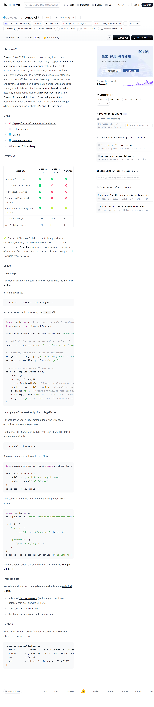

# Chronos-2 时间序列预测模型：从单变量到通用预测的统一架构

## 引言

时间序列预测作为数据科学和机器学习领域的重要研究方向，在金融、能源、交通、供应链等多个领域具有广泛的应用价值。传统的预测方法往往需要针对特定数据集进行专门的模型设计和参数调优，这不仅增加了应用成本，也限制了模型的泛化能力。近年来，随着大语言模型在自然语言处理领域取得的突破性进展，研究者开始探索将类似的预训练范式应用于时间序列预测任务，以期构建能够进行零样本预测的通用时间序列基础模型。

Chronos-2 正是在这一背景下应运而生的创新性模型。作为一个拥有 120M 参数量的编码器专用时间序列基础模型，Chronos-2 在零样本预测任务中展现出了卓越的性能。该模型的核心创新在于其统一架构设计，能够在单一模型框架内同时支持单变量预测、多变量预测以及协变量信息增强预测等多种任务类型。这种设计不仅提高了模型的通用性，也为实际应用提供了更大的灵活性。更多相关项目源码请访问：http://www.visionstudios.ltd



## 模型架构与技术原理

### 整体架构设计

Chronos-2 的架构设计灵感来源于 T5（Text-to-Text Transfer Transformer）编码器，但针对时间序列数据的特点进行了深度定制化改进。模型采用纯编码器架构，通过 Transformer 编码器学习时间序列的深层表示，并生成多步前向的分位数预测。这种设计使得模型能够有效捕捉时间序列中的长期依赖关系和复杂模式。

在模型的具体实现中，Chronos-2 采用了补丁化（patch-based）的处理方法。时间序列数据被分割成固定大小的补丁，每个补丁包含 16 个时间步的数据。这种补丁化方法不仅提高了计算效率，也有助于模型学习局部和全局的时间模式。输入补丁和输出补丁的大小均为 16，补丁之间的步长为 16，确保了数据处理的连续性和完整性。

### 组注意力机制

Chronos-2 的核心技术创新之一是其组注意力（group attention）机制。这一机制使得模型能够高效地进行跨序列和跨协变量的上下文学习。在传统的注意力机制中，模型主要关注单个序列内部的时间依赖关系。而组注意力机制则允许模型同时关注多个相关序列之间的关联性，这对于多变量预测和跨序列学习至关重要。

组注意力机制的工作原理可以理解为：模型在处理多个相关时间序列时，不仅学习每个序列自身的时间模式，还学习序列之间的相关性。例如，在预测某个商品的销售量时，模型可以同时利用该商品的历史销售数据以及其他相关商品（如替代品或互补品）的销售数据，从而提高预测的准确性。这种机制使得 Chronos-2 在多变量预测任务中表现尤为突出。

### 分位数预测与不确定性量化

传统的时间序列预测模型通常只提供点预测，即给出未来某个时间点的单一预测值。然而，在实际应用中，了解预测的不确定性往往与预测值本身同等重要。Chronos-2 通过分位数预测机制实现了对预测不确定性的量化。

模型可以同时生成多个分位数水平的预测，例如 0.1、0.5、0.9 分位数，分别对应悲观预测、中位数预测和乐观预测。通过这种方式，用户不仅可以获得点预测，还可以获得预测的置信区间，从而更好地进行风险评估和决策制定。这种不确定性量化能力在金融预测、需求预测等对风险敏感的应用场景中具有重要价值。

### 上下文长度与预测长度

Chronos-2 在上下文长度和预测长度方面相比其前代模型有了显著提升。模型支持的最大上下文长度为 8192 个时间步，这意味着模型可以处理非常长的历史数据序列。长上下文能力使得模型能够捕捉更长期的时间依赖关系，对于具有长期趋势和周期性模式的时间序列特别有效。

在预测长度方面，Chronos-2 支持最长 1024 步的前向预测，这比 Chronos 和 Chronos-Bolt 的 64 步预测长度有了质的飞跃。长预测能力使得模型能够满足更多实际应用场景的需求，例如长期需求预测、长期能源规划等。相关技术论文请访问：https://www.visionstudios.cloud

## 模型能力对比分析

为了全面评估 Chronos-2 的能力，我们将其与 Chronos-Bolt 和 Chronos 进行了详细对比。在单变量预测能力方面，三个模型都表现出了良好的性能，这体现了基础模型在零样本预测方面的优势。

在多变量预测方面，Chronos-2 展现出了明显的优势。传统的 Chronos 和 Chronos-Bolt 模型主要针对单变量预测任务设计，无法直接处理多变量时间序列。而 Chronos-2 通过其统一架构和组注意力机制，能够同时预测多个相关变量的未来值，并利用变量之间的相关性提高预测准确性。

在协变量支持方面，Chronos-2 同样表现出了显著优势。模型原生支持过去值协变量（past-only covariates）和已知未来协变量（known future covariates），无论是实值协变量还是分类协变量。相比之下，Chronos 和 Chronos-Bolt 虽然可以通过外部协变量回归器结合使用，但只能建模每个时间步的效应，无法建模跨时间的效应。Chronos-2 的原生支持使得协变量的利用更加充分和自然。

## 训练数据与方法

Chronos-2 的训练采用了大规模、多样化的数据集组合策略。训练数据主要包括三个部分：Chronos Datasets 的子集、GIFT-Eval Pretrain 的子集，以及大规模合成的单变量和多变量数据。这种多样化的训练数据确保了模型能够学习到不同类型时间序列的模式，从而具备良好的泛化能力。

在数据处理方面，模型采用了 arcsinh 变换对时间序列数据进行归一化处理。这种变换方法相比传统的对数变换或标准化方法，能够更好地处理包含零值或负值的时间序列数据，同时保持数据的相对关系。模型还使用了时间编码机制，将时间信息编码为模型可以理解的特征，这对于捕捉周期性模式至关重要。

训练过程中，模型采用了自监督学习的方法，通过预测未来时间步的值来学习时间序列的表示。这种训练方式使得模型能够学习到时间序列的内在规律，而不仅仅是对训练数据的记忆。通过大规模的训练，模型逐渐形成了对时间序列的通用理解能力，从而能够在未见过的数据上进行零样本预测。

## 性能表现与应用场景

在多个公开基准测试中，Chronos-2 展现出了最先进的零样本预测准确率。在 fev-bench、GIFT-Eval 和 Chronos Benchmark II 等权威基准测试中，模型均取得了优异的成绩。这些结果表明，Chronos-2 不仅在特定领域表现突出，更具有广泛的泛化能力。

在计算效率方面，Chronos-2 同样表现优异。模型在单个 A10G GPU 上可以实现每秒 300 多个时间序列的预测，这一效率水平使得模型能够满足大规模实际应用的需求。同时，模型支持 GPU 和 CPU 推理，为不同硬件环境下的部署提供了灵活性。

Chronos-2 的应用场景十分广泛。在金融领域，模型可以用于股票价格预测、汇率预测、利率预测等任务。在零售和供应链领域，模型可以用于销售预测、需求预测、库存管理等。在能源领域，模型可以用于电力负荷预测、能源消耗预测等。在交通领域，模型可以用于交通流量预测、出行需求预测等。在气象领域，模型可以用于温度、降水量、风速等气象要素的预测。项目专利信息请访问：https://www.qunshankj.com

## WebUI 可视化界面

为了便于用户使用和测试 Chronos-2 模型，我们开发了基于 Gradio 的可视化 Web 界面。该界面提供了直观的用户交互方式，使用户无需编写代码即可体验模型的各种功能。


WebUI 界面主要包含以下几个功能模块：

**模型加载模块**：用户可以通过点击"加载模型"按钮来初始化模型。界面会显示模型的详细状态信息，包括模型名称、参数量、架构类型、上下文长度、最大预测长度等关键参数。

**单变量预测模块**：这是界面的核心功能模块之一。用户可以输入历史时间序列数据，支持多种输入格式，包括 JSON 数组格式和逗号分隔的数值格式。用户可以设置预测长度（1 到 1024 步）和分位数水平（如 0.1、0.5、0.9）。界面还提供了"生成示例数据"功能，方便用户快速体验模型功能。预测结果会以结构化的方式展示，包括预测值范围、平均预测值、预测趋势等信息。

**多变量预测模块**：该模块支持同时预测多个相关时间序列。用户可以输入 JSON 格式的多变量数据，模型会利用组注意力机制学习变量之间的相关性，从而提供更准确的预测结果。

**模型信息模块**：该模块提供了模型的详细技术文档，包括模型架构、核心特性、技术原理、训练数据、性能表现、使用场景等信息，帮助用户全面了解模型的能力和特点。

WebUI 界面的设计充分考虑了用户体验，界面布局清晰，操作简单直观。所有功能都提供了详细的说明和提示，即使是初次使用的用户也能快速上手。界面采用响应式设计，支持不同屏幕尺寸的设备访问。

## 使用方法与部署指南

### 本地使用

对于实验和本地推理场景，用户可以通过安装 chronos-forecasting 包来使用模型。安装命令为 `pip install "chronos-forecasting>=2.0"`。安装完成后，用户可以通过简单的 Python 代码加载模型并进行预测。

使用 pandas API 进行零样本预测的典型流程如下：首先导入必要的库，包括 pandas 和 Chronos2Pipeline。然后使用 `from_pretrained` 方法加载预训练模型，可以指定设备映射（如 "cuda" 用于 GPU 推理）。接下来，用户需要准备历史目标值和协变量的过去值，这些数据通常以 pandas DataFrame 的格式提供。如果用户有已知的未来协变量值，也可以加载这些数据。最后，调用 `predict_df` 方法进行预测，可以指定预测长度、分位数水平、时间序列标识列、时间戳列和目标列等参数。

### 生产环境部署

对于生产环境的使用，我们推荐将 Chronos-2 部署到 Amazon SageMaker 平台。SageMaker 提供了完善的模型部署和管理功能，包括自动扩缩容、监控、版本管理等。部署过程相对简单：首先更新 SageMaker SDK 以确保获得最新的模型支持，然后使用 JumpStartModel 类创建模型实例，指定模型 ID 和实例类型，最后调用 deploy 方法部署推理端点。

部署完成后，用户可以通过 JSON 格式向端点发送时间序列数据进行预测。请求格式包括输入数据（时间序列值）和参数（如预测长度）。端点会返回预测结果，包括点预测和分位数预测。

## 技术优势与创新点

Chronos-2 相比传统时间序列预测方法具有多个显著优势。首先，模型的零样本能力使得用户无需针对特定数据集进行模型训练或微调，大大降低了应用门槛和成本。其次，模型的统一架构设计使得单一模型可以处理多种类型的预测任务，提高了模型的通用性和灵活性。第三，模型的长上下文和长预测能力使得其能够满足更多实际应用场景的需求。第四，模型的分位数预测能力提供了不确定性量化，有助于用户进行风险评估和决策制定。第五，模型的高效推理能力使得其能够满足大规模实际应用的需求。

从技术创新的角度来看，Chronos-2 的主要创新点包括：基于 T5 编码器的时间序列专用架构设计、补丁化处理方法、组注意力机制、分位数预测机制、以及大规模预训练策略。这些创新点的有机结合使得 Chronos-2 在保持高效推理的同时，实现了优异的预测性能。

## 结论与展望

Chronos-2 作为时间序列预测领域的重要进展，通过统一架构设计实现了从单变量到通用预测的跨越。模型在多个基准测试中展现出的优异性能，以及其零样本预测能力，为时间序列预测的实际应用提供了新的可能性。

未来，随着模型规模的进一步扩大、训练数据的进一步丰富、以及架构设计的进一步优化，我们有理由相信，时间序列基础模型将在更多领域发挥重要作用。同时，如何将模型更好地与领域知识结合，如何提高模型在特定领域的预测精度，如何进一步优化模型的推理效率，都是值得深入研究的方向。

Chronos-2 的开源发布为研究社区和工业界提供了强大的工具，我们期待看到更多基于 Chronos-2 的创新应用和研究工作。通过社区的共同努力，时间序列预测技术将不断进步，为各个领域的决策制定提供更准确、更可靠的预测支持。

## 引用

如果您在研究中使用了 Chronos-2 模型，请引用以下论文：

```
@article{ansari2025chronos2,
  title        = {Chronos-2: From Univariate to Universal Forecasting},
  author       = {Abdul Fatir Ansari and Oleksandr Shchur and Jaris Küken and Andreas Auer and Boran Han and Pedro Mercado and Syama Sundar Rangapuram and Huibin Shen and Lorenzo Stella and Xiyuan Zhang and Mononito Goswami and Shubham Kapoor and Danielle C. Maddix and Pablo Guerron and Tony Hu and Junming Yin and Nick Erickson and Prateek Mutalik Desai and Hao Wang and Huzefa Rangwala and George Karypis and Yuyang Wang and Michael Bohlke-Schneider},
  year         = {2025},
  url          = {https://arxiv.org/abs/2510.15821}
}
```
